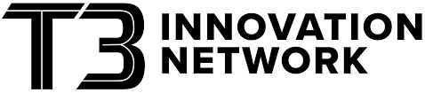
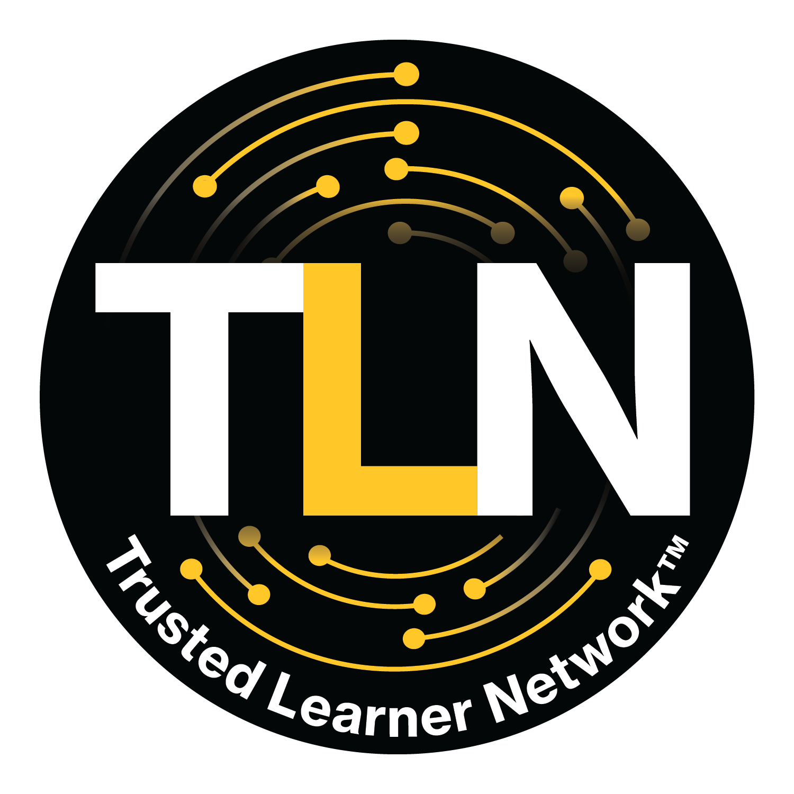

	

		

			<h1>About the LER Ecosystem Map</h1>
		

	

	

		

			

				
The LER Ecosystem Map was developed through a collaborative effort among a group of key stakeholders across education, technology, government, and research and advocacy. Version 1 of the map identified value propositions and action areas for stakeholders with the goal of broadening adoption and cultivating effective, equitable use of LERs. This second iteration of the LER Ecosystem Map has been redesigned to offer a more user-friendly experience. It aims to address the persistent gaps in understanding about the roles of the stakeholders and define commonly used terminology and frameworks in a more accessible way.

				
The LER Ecosystem Map contains stakeholder pages that provide a brief <strong>definition</strong> and <strong>examples</strong> of the stakeholder group, an overview of their <strong>roles and work streams</strong> within the ecosystem with regards to developing, issuing, using, and adopting LERs, social and business case <strong>value propositions</strong>, and <strong>action areas</strong> to promote effective use and adoption of LERs in service of equity and opportunity. The Map offers an overview of <strong>how we use LERs and why they matter</strong>, <strong>technical guidance</strong>, and additional <strong>resources</strong> to help you learn more.

				
LERs function within a broad ecosystem of stakeholders working in different capacities across a number of work streams related to learning and employment. Technical and philosophical alignment among these stakeholders is critical in cultivating an LER ecosystem that promotes equity in education and employment, protects learner data, and optimizes processes for employers, policymakers, and education and training providers. 

				<blockquote>This LER Ecosystem Map is a tool for all those involved, and those who want to be involved, in building this future — a tool to empower us all to focus on key challenges and connect through our shared mission. </blockquote>
				
Alongside the development of digital versions of micro-credentials, certificates, diplomas and degrees, the defining, describing,  and recognition of granular skills and competencies is well underway. Right now, we have a tremendous opportunity and responsibility to make sure it is done right, with access to opportunity at its heart. Building an ecosystem in which all stakeholders can derive and trust in the value of LER investments will require engaging a diverse set of employers, learners, and educators, proving value with evidence of data on impact, and empowering the whole ecosystem to allow for both degree and skills- based models. 

				
So, let’s dive in. Innovation will keep moving at pace, which means opportunity can’t wait. For widespread access to opportunity, for learner and earner empowerment, for efficiency and effectiveness in matching great talent to great jobs — let’s do this together. 

			
		
		
	
	

	

		

			

				
Special thanks to those who have contributed their thoughts and content to this site:

			
		
		
	
	

	

		

			

				
			

			

				
			

			

				
			

		

		

			

				
			

			

				
			

			

				
			

		

		

			

				
			

			

				
			

			

				
			

		

		

			

				
			

			

				
			

			

				
			

		

		

			

				
			

		

	

	

		

			

				
Thank you to <a href="https://weareopen.coop/" taget="_blank">We Are Open</a> for their support of version 2 of the site.
 
			
		
		
	
	

	

		

			

				
Thank you to <a href="https://nationswell.com/" target="_blank">NationSwell</a> and <a href="https://www.learningeconomy.io/" target="_blank">Learning Economy Foundation</a> for their support of version 1 of the site.
 
			
		
		
	
	

	

		

			

				
The content on this site is licensed under a <a href="https://creativecommons.org/licenses/by/4.0/" target="_blank">Creative Commons Attribution 4.0 International License</a>. 

				
Please submit feedback <a href="https://forms.gle/j4mMrFCtnFksqgDg8" target="_blank">here</a> and/or contribute an issue and content <a href="https://github.com/digitalcredentials/ler-ecosystem-map-v2" target="_blank">here</a>.
 
			
		
		
	
	

