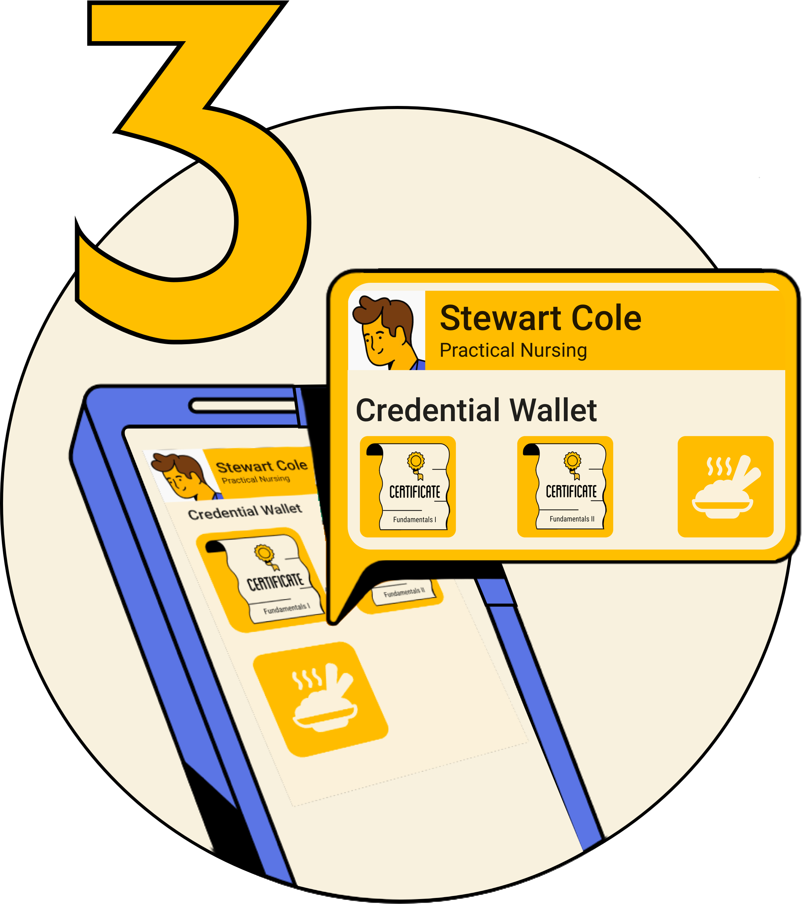
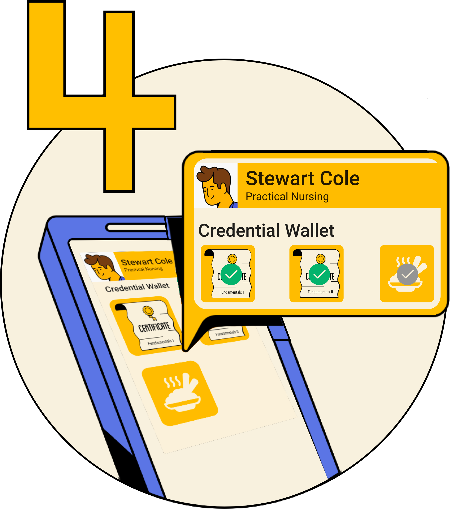
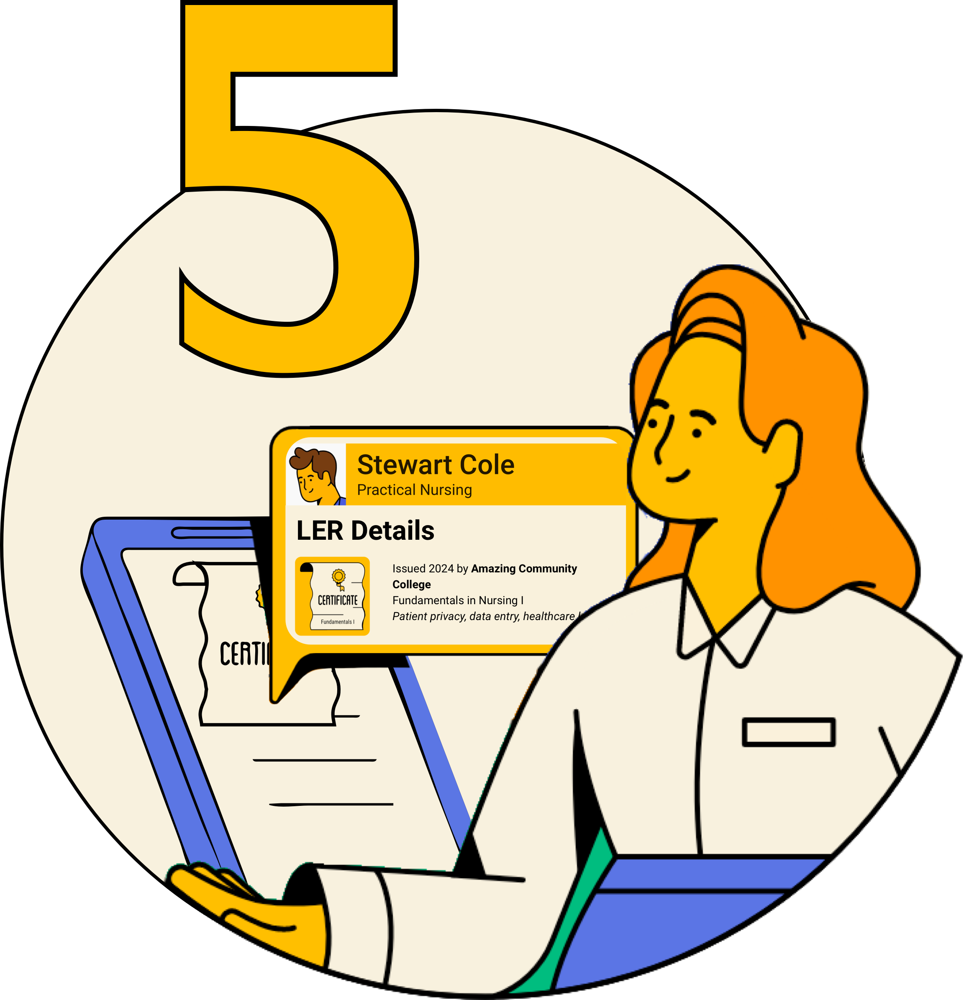

	<h2>How Do We Use LERs?</h2>

	

	

<h3>Learner makes an achievement</h3>

Scenario: Stewart (the <i>learner/earner</i>) is currently studying in a Licensed Practical Nursing Program at Amazing Community College. They have already completed prerequisite algebra and Fundamentals of Nursing I & II.

	

<h3>Issuer issues credential</h3>

Amazing Community College (the <i>issuer</i>) issues a digital credential for Stewarts’s completion of Fundamentals of Nursing I & II.

	

<h3>Learner obtains credential</h3>

Stewart receives their credential in a digitally signed format. She is able to import this credential and store it in a digital wallet application. 

	

<h3>Learner shares a credential</h3>

Stewart has not finished their LPN program yet. However, they would like to get a job in the healthcare field while continuing their studies part time. They apply for an administrative position at a local nursing home. Stewart is able to share their credentials for Fundamentals of Nursing I & II. Within these credentials they can demonstrate their mastery of specific skills and competencies, such as patient data privacy and healthcare lexicon. Though they also have a digital certification for food service, they choose not to share this credential with the nursing home. 

	

<h3>Consumer verifies a credential</h3>

The nursing home (the consumer or <i>verifier</i>) is able to view Stewart’s LER and see that Amazing Community College, an accredited institution, has issued their credentials within the past year. They can see specifically that they have studied patient privacy, which is required for the administrative position. Stewart moves forward in the hiring process!

	

<h3> The learner continues to add to their LER throughout their lifetime</h3>

Stewart completes their academic program, passes the required exams and becomes a Licensed Practical Nurse. While employed, they continue to build their skill set, obtaining additional certifications in phlebotomy and pharmacology. Later they decide to change careers, applying to work at a research lab. 

 