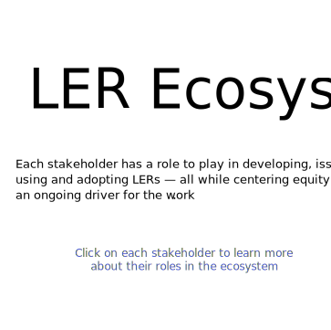
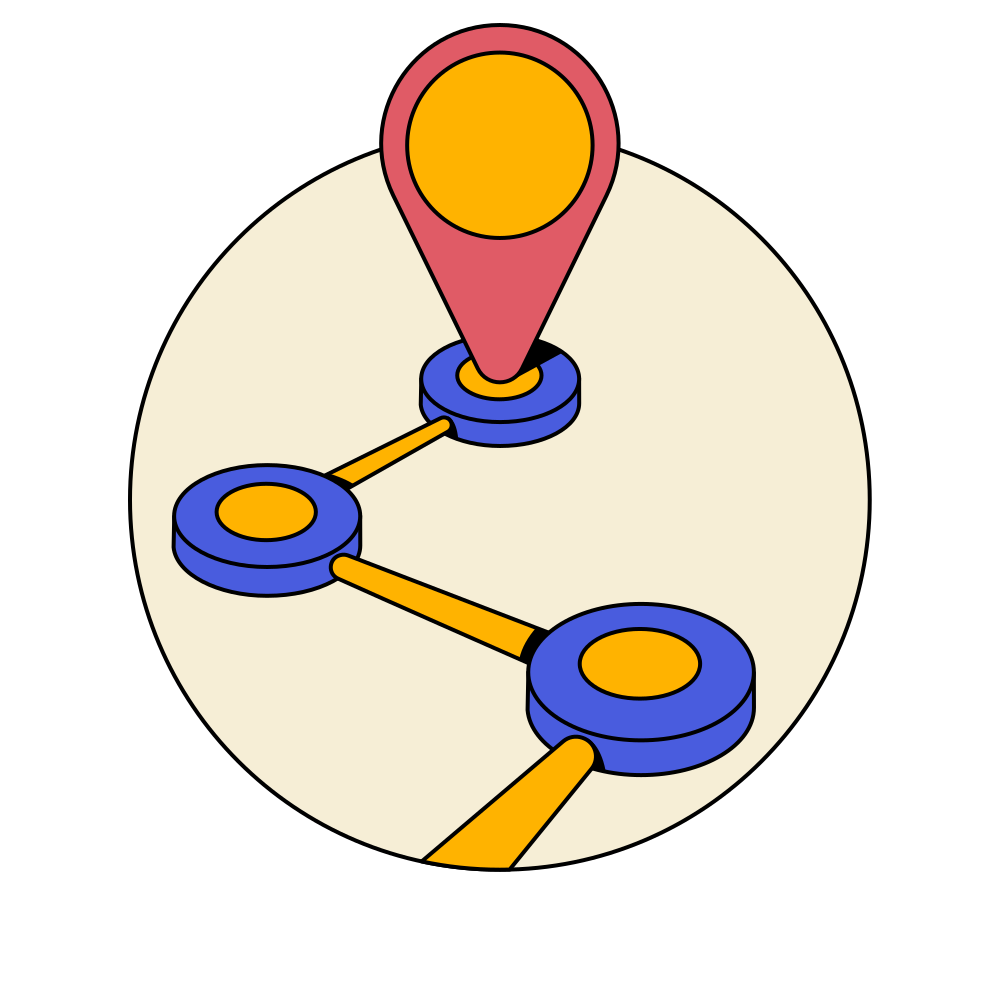

	

		

			

				
				

					<a href="stakeholder/employers">
					<h4 class="nav-heading small">Employers</h4>
					</a>
				

				

					<a href="stakeholder/solution-providers">
					<h4 class="nav-heading small">LER Solution Providers</h4>
					</a>
				

				

					<a href="stakeholder/governance">
					<h4 class="nav-heading small">Governance</h4>
					</a>
				

				

					<a href="stakeholder/career-navigators">
					<h4 class="nav-heading small">Career Navigators</h4>
					</a>
				

				

					<a href="stakeholder/hr-systems">
					<h4 class="nav-heading small">HR Systems</h4>
					</a>
				

				

					<a href="stakeholder/learners-earners">
					<h4 class="nav-heading small">Learners and Earners</h4>
					</a>
				

				

					<a href="stakeholder/funders">
					<h4 class="nav-heading small">Funders</h4>
					</a>
				

				

					<a href="stakeholder/supporting-systems">
					<h4  class="nav-heading small">Supporting Systems</h4>
					</a>
				

				

					<a href="stakeholder/credentialing-organizations">
					<h4 class="nav-heading small">Credentialing Organizations</h4>
					</a>
				

				

					<a href="stakeholder/data-standards-organizations">
					<h4 class="nav-heading small">Data Standards Organizations</h4>
					</a>
				

			

		

	

	

		

			
		

		

			

				<h2 class="sub-heading imagine">Imagine A World Where...</h2>
				<ul role="list">
					<li class="body-text-medium">Everyone is empowered to access learning and earning opportunities based on what they know and can do, whether those skills and abilities are obtained through degrees, work experiences, or independent learning. ‍</li>
					<li class="body-text-medium">People can capture and communicate the skills and competencies they’ve acquired across their entire learning journey — from education, experience and service — with more ease, confidence, and clarity than a traditional resume. ‍</li>
					<li class="body-text-medium">Learners and earners control their information and can curate their skills to take advantage of every opportunity they are truly qualified to pursue, opening up pathways that help address systemic inequities. ‍</li>
					<li class="body-text-medium">Employers can tap into a wider talent pool and better match applicants to opportunities with verifiable credentials that represent skills, competencies, and achievements. ‍</li>
				</ul>
				
This is the world that we believe can be created with the adoption of Learning and Employment Records, or LERs, digital representations of a person’s skills and achievements obtained throughout their lifetime through education, employment and life experiences. LERs provide many advantages that can empower learners and job seekers as well as educators and employers alike. Compared to traditional resumes, LERs are:
				<ul role="list">
					<li class="body-text-medium"> learner centered and controlled. Once a learner receives a credential, such as a degree, certificate, or training completion, they maintain ownership of their data and can curate their skills and experiences towards a desired learning or career opportunity.</li>
					<li class="body-text-medium"> data-rich. LERs can include valuable information on learning objectives and outcomes, employers with more relevant and granular information about an individual’s skills and abilities</li>
					<li class="body-text-medium"> verifiable. LERs contain information on the institution, organization, or individual who has attested to the learners achievement, such that regulated credentials like licensures can be proven valid</li>
				</ul>
				

				
LERs function within a broad, dynamic ecosystem, one that contains the learners themselves, employers both seeking skills in the workforce and endowing them on the job, education and training providers with a diverse set of delivery models, to name a few. An aligned, well-functioning LER ecosystem creates benefits for learners, earners, and employers. It offers opportunities for improving education outcomes and hiring processes, supporting meaningful careers, and promoting economic mobility.

			

		

	

