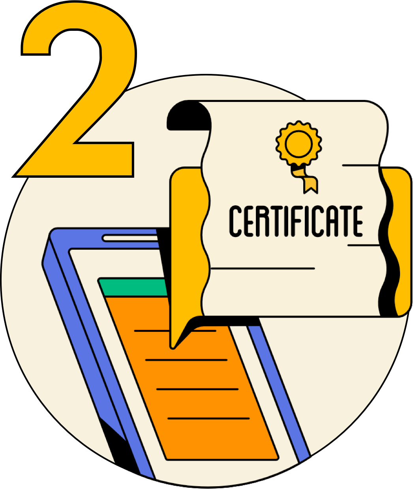
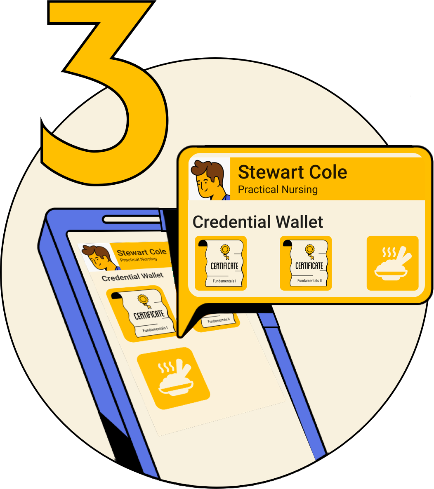
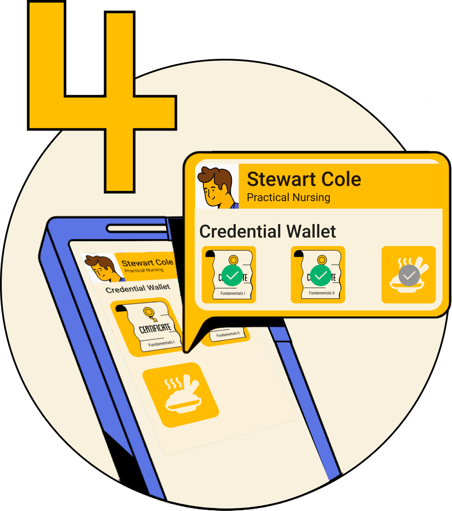
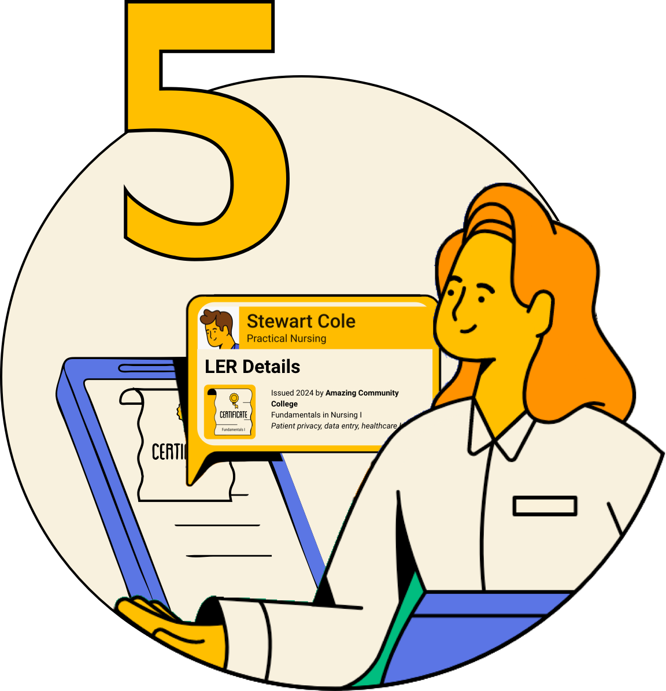

    

        

            <h1>What are LERs?</h1>
        

    

    

        

            
Learning and Employment Records (LERs) are digital records of a person’s learning and work experiences. LERs span education, the workplace, and service and life experience. They offer several advantages to traditional CVs or resumes.

            <ul class="list">
                <li>They are verifiable, digitally signed by the individual or organization who has issued the credential. This means that when viewing the credential, an institution or employer can ascertain that it is valid and untampered with.</li>
                <li>They are developed in accordance with open standards – data models and frameworks that are collaboratively designed and maintained. This ensures that credentials issued by one institution are technically and semantically compatible, or interoperable, with those of another institution who is also using the same standards. Standards like W3C Verifiable Credentials and Decentralized Identifiers make it possible for LERS to not only be transportable with each other but also with other claims made online that use these standards including citizenship and other government documents. This means that LERs will have increased applicability and usability across many applications across the web.
                </li>
                <li>LERs are learner controlled. Traditional credentials may be stored in databases belonging to institutions or clearinghouses. However, once a learner receives a verifiable LER, they retain access to and control of that data and are able to decide how, when, and under what circumstances they want to share it with potential educators or employers in the pursuit of opportunities.</li>
                <li>They can be issued for large scale achievements like degrees or diplomas or more granularly for individual courses or even particular skills or competencies. This means learners and earners can curate their experiences obtained through traditional or non-traditional means and employers can more easily identify talent with a desired skill set.</li>
            </ul>
        

    

    

        

            <h1>Why Do They Matter?</h1>
        

    

    

        

            
LERs are a tool with the potential to help increase economic mobility for all. Giving learners and earners control over their data empowers them to use it to access a variety of opportunities.  LERs help by providing flexibility to  market relevant skills while applying for jobs and education programming. They can also help prove eligibility for benefits. For employers, LERs can offer detailed information, allowing them to predict performance on the job and guide them in designing their training and upskilling to more efficiently meet the demands of their workforce. 
 
            
Education and employment systems and technologies, especially those focused on leveraging skills, are innovating rapidly, but hiring practices still rely heavily on PDF resumes, transcripts, references and other proxies; all of which provide an incomplete picture of candidates. Verifiable, comprehensive, and data-rich LERs offer a solution. However, we must take intentional steps to ensure all stakeholders and work streams within the LER Ecosystem are in harmony, perpetuating equitable access to meaningful careers and education. 

        

    

    

        

            <h1>How Do We Use LERs?</h1>
            
The steps below illustrate an example scenario.

        

    

    

         

            
        

        

            <h4>Learner makes an achievement</h4>
            
Stewart (the <i>learner/earner</i>) is currently studying in a Licensed Practical Nursing Program at Amazing Community College. They have already completed prerequisite algebra and Fundamentals of Nursing I & II.

        

    

    

        

            
        

        

            <h3>Issuer issues credential</h3>
            
Amazing Community College (the <i>issuer</i>) issues a digital credential for Stewarts’s completion of Fundamentals of Nursing I & II.

        

    

    

        

            
        

        

            <h3>Learner obtains credential</h3>
            
Stewart receives their credential in a digitally signed format. They are able to import this credential and store it in a digital wallet application. 

        

    

    

        

            
        

        

            <h3>Learner shares a credential</h3>
            
Stewart has not finished their LPN program yet. However, they would like to get a job in the healthcare field while continuing their studies part time. They apply for an administrative position at a local nursing home. Stewart is able to share their credentials for Fundamentals of Nursing I & II. Within these credentials they can demonstrate their mastery of specific skills and competencies, such as patient data privacy and healthcare lexicon. Though they also have a digital certification for food service, they choose not to share this credential with the nursing home. 

        

    

    

        

            
        

        

            <h3>Consumer verifies a credential</h3>
            
The nursing home (the consumer or <i>verifier</i>) is able to view Stewart’s LER and see that Amazing Community College, an accredited institution, has issued their credentials within the past year. They can see specifically that they have studied patient privacy, which is required for the administrative position. Stewart moves forward in the hiring process!

        

    

    

        

            
         

         

            <h3> The learner continues to add to their LER throughout their lifetime</h3>
            
Stewart completes their academic program, passes the required exams and becomes a Licensed Practical Nurse. While employed, they continue to build their skill set, obtaining additional certifications in phlebotomy and pharmacology. Later they decide to change careers, applying to work at a research lab. 

        

    

